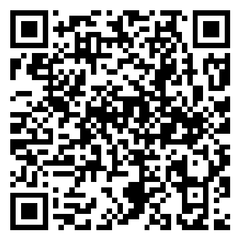
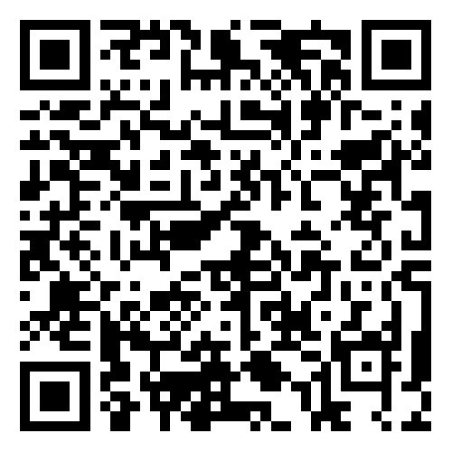

# 💗 赞助支持

如果您觉得我的内容对您有帮助，欢迎通过以下方式支持我的创作。  
您的每一份支持都是我持续创作的动力！

> 所有赞助将用于网站维护、服务器费用以及内容创作。

---

## 支付方式

<!-- 支付宝 -->

  

    
    支付宝
  

  

<!-- 微信 -->

  

    
    微信支付
  

  

---

## 其他支持方式

  

    
📣

    
分享推荐

    
将我的博客分享给更多朋友

  

  

    
💬

    
留言互动

    
在文章下方留下您的想法

  

  

    
⭐

    
关注订阅

    
订阅RSS或关注社交媒体

  

---

## 已赞助的小伙伴

暂无赞助记录，成为第一位赞助者吧！

> 如果您已赞助，并且想加入赞助名单，请发送邮件至  
> [sponsor@242531778@qq.com](mailto:sponsor@242531778@qq.com?subject=赞助提交&body=您好，我已赞助，请将我加入赞助名单。)